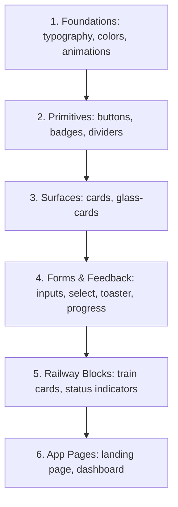

# Railverse Design System — UI Handbook (v2.0.0)

This document is the single source of truth for all UI/UX development inside Railverse v2.0.0. All components are built with strict **TypeScript**, styled using **Tailwind CSS v4** design variables, support native **Dark Mode**, respect user **Reduced Motion** preferences, and pass automated **Accessibility (WCAG AA)** tests.

---

## ✦ 1. Architecture & Token System

### 1.1 Centralized Motion (`src/lib/motion/`)
Animations utilize custom Framer Motion spring presets to keep interfaces fast, responsive, and hardware-accelerated:
- **`scalePresets` (`scale.ts`)**: Snappy scale taps (`0.98`) and subtle hover adjustments.
- **`hoverPresets` (`hover.ts`)**: Standard brightness shifts, light opacity dims, and spring lifts.
- **`modalVariants` (`modal.ts`)**: Spring scale-ups and slide-ins for overlays/dialogs.
- **`drawerVariants` (`drawer.ts`)**: Directional slide-ins from screen edges.
- **`pageVariants` (`page.ts`)**: Smooth page transitions.
- **`SPRING_PRESETS` & `EASE_PRESETS` (`transitions.ts`)**: Physics curves (Default, Gentle, Snappy, Bouncy).

### 1.2 TypeScript Tokens (`src/config/design-tokens.ts`)
CSS variables are mapped to TypeScript-accessible tokens (`DESIGN_TOKENS`) for use in JavaScript charts (e.g. gen-charts, SVG lines), canvas objects, or calculations.

---

## ✦ 2. Component Hierarchy

We organize our codebase into a clear layer hierarchy. Elements in higher tiers compose elements from lower tiers, but not vice-versa:



1. **Foundations**: CSS variables, typography components, and motion presets.
2. **Primitives**: Base atomic interactives (e.g., `Button`, `Input`, `Badge`, `Divider`).
3. **Surfaces**: Container layout panels (e.g., `Card`, `GlassCard`).
4. **Forms & Feedback**: Layout controls (e.g., `Checkbox`, `DatePicker`, `Toast`, `Spinner`, `EmptyState`).
5. **Railway Blocks**: Domain-specific compound units (e.g., `TrainCard`, `AvailabilityMeter`).
6. **App Pages**: Layout frameworks wrapping blocks together.

---

## ✦ 3. Component Composition Philosophy

To keep the codebase maintainable, we adhere to three design philosophies:

### 3.1 Compound over Config Props
Avoid creating components with massive prop lists (e.g., `<Card title=".." footer=".." description=".." />`). Instead, build compound components that assemble modularly:
```tsx
// YES
<Card>
  <CardHeader>
    <CardTitle>Heading</CardTitle>
  </CardHeader>
  <CardContent>Content Body</CardContent>
</Card>
```
*Rationale*: Gives developers full flexibility to insert icons, badges, or buttons anywhere in the markup without polluting the parent component's API.

### 3.2 Polymorphic Rendering (`asChild`)
Always support Radix UI's `Slot` utility via the `asChild` prop on primary layout triggers (e.g., `Button`, `Link`, typography primitives).
```tsx
// YES
<Button asChild variant="outline">
  <Link href="/dashboard">Dashboard</Link>
</Button>
```
*Rationale*: Bypasses duplicate HTML wrappers and class pollution when combining routing components (`next/link`) with design system primitives.

### 3.3 Strict Ref Forwarding
Every reusable component must be wrapped in `React.forwardRef` and attach the incoming ref to the root elements.
```tsx
// YES
export const CustomInput = React.forwardRef<HTMLInputElement, Props>(
  ({ className, ...props }, ref) => (
    <input ref={ref} className={cn("...", className)} {...props} />
  )
);
CustomInput.displayName = "CustomInput";
```
*Rationale*: Enables libraries (e.g. Framer Motion, react-hook-form, Radix overlay primitives) to interact with DOM nodes directly for positioning and focus containment.

---

## ✦ 4. Naming & Variant Conventions

- **Component Names**: Always use `PascalCase` (e.g., `IconButton`, `GlassCard`).
- **Story files**: Suffix with `.stories.tsx` (e.g., `button.stories.tsx`). Place inside the component directory.
- **Unit tests**: Suffix with `.test.tsx` (e.g., `button.test.tsx`).
- **CVA Variants**:
  - `variant`: Mapped to theme colors: `default`, `secondary`, `outline`, `ghost`, `link`, `success` (emerald), `warning` (amber), `destructive`/`danger` (red), `info` (blue).
  - `size`: Always scale using standard T-shirt sizes: `sm`, `md`, `lg`.

---

## ✦ 5. Accessibility (A11y) Rules

Every element added to the design system must be designed for accessibility:
1. **Focus Rings**: Interactive elements must include outline rings (`focus-visible:ring-2 focus-visible:ring-ring focus-visible:ring-offset-2`) that remain visible under keyboard navigation.
2. **Keyboard Handlers**: Polymorphic triggers must execute actions on Enter and Spacebar keypresses.
3. **Strict Alt & Labels**: Icon-only buttons (`IconButton`) require an explicit string for the `aria-label` attribute.
4. **Invalid States**: Forms in error states must assign `aria-invalid="true"` to active inputs and link descriptions using `aria-describedby` matching helpers.
5. **Programmatic Audit**: All unit tests must include a `jest-axe` accessibility audit:
   ```typescript
   it("should have no accessibility violations", async () => {
     const { container } = render(<Component />);
     const results = await axe(container);
     expect(results).toHaveNoViolations();
   });
   ```

---

## ✦ 6. Do's and Don'ts

### Do:
- **Do** respect user system motion preferences. Wrap interactive tags in `motion` with spring presets that honor OS `prefers-reduced-motion` settings.
- **Do** execute `React.useId()` unconditionally at the top level of component renders.
- **Do** omit conflicting HTML parameters (e.g., omit `"prefix" | "suffix" | "size"` from inputs) to prevent namespace collisions.

### Don't:
- **Don't** use ad-hoc inline transition settings. Always import configurations from `src/lib/motion/`.
- **Don't** add complex business logic or fetch triggers inside foundational primitives. Primitives should remain purely representational.
- **Don't** duplicate Tailwind color tokens in TS files. Reference `DESIGN_TOKENS` or use native Tailwind v4 class names.

---

## ✦ 7. Future Extension Checklist

When creating a new design system component, follow this exact workflow:

1. **Implement Core Logic**: Create `src/components/ui/my-component.tsx` utilizing CVA, proper TS props, ref forwarding, and displayName definition.
2. **Configure Stories**: Create `src/components/ui/my-component.stories.tsx` under CSF v3. Verify states (default, hover, focus, disabled, loading, light/dark themes).
3. **Write Unit & Accessibility Tests**: Create `src/components/ui/my-component.test.tsx` verifying:
   - Dynamic class variants.
   - User event handling (click, keypress, typing).
   - Automated `axe` accessibility validation.
4. **Run Checks**: Run typechecking (`npx tsc --noEmit`), linting (`npm run lint`), and tests (`npm run test`) locally.
5. **Document**: Add the component API table and usage guide in this file (`DESIGN_SYSTEM.md`).

---

## ✦ 8. Form Components

### 8.1 Checkbox
- **Purpose**: Let users choose binary options (on/off) or select multiple entries from list selections.
- **API Props**:
  - `checked?: boolean | "indeterminate"` (Controlled state)
  - `defaultChecked?: boolean` (Uncontrolled initialization)
  - `onCheckedChange?: (checked: boolean | "indeterminate") => void`
  - `disabled?: boolean` (Locked opacity)
  - `error?: boolean` (Red warning highlight)
  - `label?: string` (Associated helper text triggers checked state when clicked)
  - `helperText?: string` (Extra detail text placed beneath the label)
- **Accessibility**: Toggled by Space keypress. Follows Radix UI checkbox ARIA properties.

### 8.2 Radio Group
- **Purpose**: Let users select a single choice from a mutually exclusive list.
- **API Props**:
  - `options: Array<{ value: string, label: string, description?: string, disabled?: boolean }>`
  - `value?: string` / `defaultValue?: string`
  - `onValueChange?: (value: string) => void`
  - `orientation?: "vertical" | "horizontal"` (Default is vertical)
  - `disabled?: boolean` / `error?: boolean`
  - `helperText?: string`
- **Accessibility**: Arrow key navigation toggles options in group automatically. Exposes proper list grouping tags.

### 8.3 Select
- **Purpose**: Clean single-selection dropdown list when space is premium.
- **API Props**:
  - `options: Array<{ value: string, label: string, disabled?: boolean }>`
  - `placeholder?: string`
  - `disabled?: boolean` / `error?: boolean` / `loading?: boolean` (Triggers loader inside choice trigger)
  - `value?: string` / `defaultValue?: string`
  - `onValueChange?: (value: string) => void`
- **Accessibility**: Keyboard Arrow Up/Down traversal, selects on Enter, dismisses on Escape.

### 8.4 Combobox
- **Purpose**: Rich auto-suggestion dropdown combining filter inputs with selection lists.
- **API Props**:
  - `options: Array<{ value: string, label: string }>`
  - `value?: string` / `defaultValue?: string`
  - `onChange?: (value: string) => void`
  - `onSearchChange?: (search: string) => void` (Delegates filtering to parent for async loads)
  - `loading?: boolean`
  - `disabled?: boolean` / `error?: boolean`
  - `emptyState?: React.ReactNode`
- **Accessibility**: Auto focus search inputs, list item selection via arrow keys and enter commands.

### 8.5 Switch
- **Purpose**: Toggles preference settings or options instantly.
- **API Props**:
  - `checked?: boolean` / `onCheckedChange?: (checked: boolean) => void`
  - `label?: string` / `description?: string`
  - `disabled?: boolean`
- **Accessibility**: Spacebar toggles values, includes dynamic sliding track thumbs.

### 8.6 Slider
- **Purpose**: Let users select values from a continuous range (single thumb or double-thumb ranges).
- **API Props**:
  - `value?: number[]` / `defaultValue?: number[]`
  - `onValueChange?: (value: number[]) => void`
  - `min?: number` / `max?: number` / `step?: number`
  - `showTicks?: boolean` (Renders label ticks underneath track bounds)
  - `disabled?: boolean`
- **Accessibility**: Adjust values using keyboard Arrow keys.

### 8.7 OTP Input
- **Purpose**: Let users input secure passcode digits (e.g. mobile validation PINs).
- **API Props**:
  - `length?: number` (Default is 6 cells)
  - `value?: string` / `onChange?: (value: string) => void`
  - `type?: "numeric" | "alphanumeric"`
  - `mask?: boolean` (Hides characters)
  - `disabled?: boolean` / `error?: boolean`
- **Features**: Auto advance focus, backspace focus return shifts, clipboard paste splits.

### 8.8 Date Picker
- **Purpose**: Calendar picker supporting onward journeys or multi-date return ranges.
- **API Props**:
  - `value?: Date | { from?: Date; to?: Date }`
  - `onChange?: (date: any) => void`
  - `mode?: "single" | "range"`
  - `placeholder?: string`
  - `disabled?: boolean` / `error?: boolean`
- **Features**: Leverages `react-day-picker` internally. Styled to match Railverse design templates.

---

## ✦ 9. Feedback Components

### 9.1 Alert
- **Purpose**: Displays system-wide notifications or warnings.
- **API Props**:
  - `variant?: "default" | "info" | "success" | "warning" | "error"`
  - `title?: string` / `description?: string`
  - `icon?: React.ReactNode` (Optional layout override)
- **Accessibility**: Renders with semantic `role="alert"` wrapper.

### 9.2 Toast
- **Purpose**: Snappy global overlay notifications.
- **API triggers**:
  - `toast.success("Message", "Title")`
  - `toast.warning("Message")`
  - `toast.error("Message")`
  - `toast.loading("Message")`
  - `toast.promise(promise, { loading: "...", success: "...", error: "..." })`
- **Accessibility**: Mounted in a floating corner region with ARIA polite live announcers.

### 9.3 Progress
- **Purpose**: Track sync loads or journey progress intervals.
- **API Props**:
  - `value?: number | null` (Value between 0-100; null triggers custom indeterminate animations)
  - `variant?: "linear" | "circular"`
  - `size?: "sm" | "md" | "lg"`
- **Accessibility**: Exposes `aria-valuenow`, `aria-valuemin`, and `aria-valuemax` to screen readers.

### 9.4 Spinner
- **Purpose**: Clean loader.
- **API Props**:
  - `variant?: "default" | "brand"`
  - `size?: "xs" | "sm" | "md" | "lg"`

### 9.5 Skeleton
- **Purpose**: Loading state placeholder blocks.
- **API Props**:
  - `variant?: "text" | "avatar" | "card" | "table" | "custom"`
- **Accessibility**: Halts animations under reduced motion.

### 9.6 Loading Overlay
- **Purpose**: Portaled glass layout blocks.
- **API Props**:
  - `visible: boolean`
  - `message?: string`
  - `usePortal?: boolean` (Default is true)

### 9.7 Empty State
- **Purpose**: Reusable zero-data screen component.
- **API Props**:
  - `icon?: React.ReactNode`
  - `title?: string`
  - `description?: string`
  - `action?: React.ReactNode` (Button action triggers)
  - `illustration?: React.ReactNode` (Visual banner placeholder slot)
- **Composition**: Supports children layout content.

### 9.8 Error State
- **Purpose**: Reusable retry panel component.
- **API Props**:
  - `title?: string`
  - `description?: string`
  - `onRetry?: () => void`
  - `actions?: React.ReactNode` (Allows composable buttons like Go Home, Contact Support)
- **Composition**: Supports children layout content.

---

## ✦ 10. Layout Components

### 10.1 App Shell
- **Purpose**: Structural layout wrapper coordinating sticky header, left/right sidebars, main contents, and footers.
- **API Props**:
  - `header?: React.ReactNode`
  - `sidebar?: React.ReactNode`
  - `rightSidebar?: React.ReactNode`
  - `footer?: React.ReactNode`
  - `children: React.ReactNode`

### 10.2 Page Container
- **Purpose**: Max-width structural bounds container.
- **API Props**:
  - `size?: "sm" | "md" | "lg" | "xl" | "full"`

### 10.3 Section
- **Purpose**: Vertical spacing wrapper with optional division borders.
- **API Props**:
  - `spacing?: "none" | "sm" | "md" | "lg" | "xl"`
  - `divider?: boolean`

### 10.4 Content Grid
- **Purpose**: Responsive CSS-Grid container mapping column configurations.
- **API Props**:
  - `cols?: 1 | 2 | 3 | 4 | "sidebar" | "split"`
  - `gap?: "none" | "sm" | "md" | "lg" | "xl"`

### 10.5 Stack
- **Purpose**: Flex direction column primitive spacing helper.
- **API Props**:
  - `gap?: "none" | "xs" | "sm" | "md" | "lg" | "xl" | "xxl"`
  - `align?: "start" | "center" | "end" | "stretch"`
  - `justify?: "start" | "center" | "end" | "between"`

### 10.6 Cluster
- **Purpose**: Flex direction row inline spacing helper with wrapping.
- **API Props**:
  - `gap?: "none" | "xs" | "sm" | "md" | "lg" | "xl"`
  - `align?: "start" | "center" | "end" | "baseline"`
  - `justify?: "start" | "center" | "end" | "between" | "around"`
  - `wrap?: boolean`

### 10.7 Split View
- **Purpose**: Responsive double-pane split view container.
- **API Props**:
  - `ratio?: "1:1" | "2:1" | "1:2" | "3:1" | "1:3"`
  - `gap?: "none" | "sm" | "md" | "lg"`
  - `left: React.ReactNode`
  - `right: React.ReactNode`

### 10.8 Scroll Area
- **Purpose**: Wraps Radix ScrollArea to display custom, styled scrollbars.
- **API Props**:
  - `orientation?: "vertical" | "horizontal" | "both"`

### 10.9 Sticky Region
- **Purpose**: Sticky boundary container region.
- **API Props**:
  - `position?: "top" | "bottom"`
  - `offset?: number`
  - `zIndex?: number`

---

## ✦ 11. Navigation Components

### 11.1 Header
- **Purpose**: Sticky application header with transparent/solid transitions, responsive triggers, and scroll-aware blurs.
- **API Props**:
  - `variant?: "solid" | "transparent"`
  - `glassmorphism?: boolean`
  - `sticky?: boolean`
  - `logo?: React.ReactNode`
  - `navigation?: React.ReactNode`
  - `actions?: React.ReactNode`
  - `scrollAware?: boolean`

### 11.2 Navigation Bar
- **Purpose**: Horizontal desktop navbar with active states, focus rings, and mobile collapse indicators.
- **API Props**:
  - `items: Array<{ href: string, label: string, active?: boolean, icon?: React.ReactNode }>`
  - `collapse?: boolean`

### 11.3 Sidebar
- **Purpose**: Expandable side drawer with persistent/floating layouts, nesting groups, active states, and collapse states.
- **API Props**:
  - `groups: SidebarGroup[]`
  - `variant?: "persistent" | "floating"`
  - `collapsed?: boolean`
  - `mini?: boolean`
  - `pinned?: boolean`

### 11.4 Mobile Navigation
- **Purpose**: Bottom tab navigation bar combined with an slide-in gesture-friendly drawer.
- **API Props**:
  - `items: MobileNavItem[]`
  - `drawerContent?: React.ReactNode`

### 11.5 User Menu
- **Purpose**: Dropdown trigger displaying Avatar, Name, Email, and action groups.
- **API Props**:
  - `avatarUrl?: string`
  - `name: string`
  - `email: string`
  - `groups: Array<{ label?: string, items: UserMenuAction[] }>`

### 11.6 Profile Menu
- **Purpose**: Reusable profile menu trigger displaying an avatar dropdown list.
- **API Props**:
  - `avatarUrl?: string`
  - `fallbackText?: string`
  - `items?: ProfileMenuItemProps[]`

### 11.7 Notification Menu
- **Purpose**: Bell icon trigger with a notification count badge, displaying a scrollable list dropdown.
- **API Props**:
  - `count?: number`
  - `children: React.ReactNode`

### 11.8 Breadcrumb
- **Purpose**: Hierarchy path indicators supporting separator customization and overflow items.
- **API Props**:
  - `items: BreadcrumbItem[]`
  - `separator?: React.ReactNode`
  - `maxVisibleItems?: number`

### 11.9 Tabs
- **Purpose**: Radix Tabs primitive wrapper with scroll indicators, badges, and icon support.
- **API Props**:
  - `items: TabItem[]`

### 11.10 Pagination
- **Purpose**: Previous/Next numbered pagination supporting mobile layouts.
- **API Props**:
  - `currentPage: number`
  - `totalPages: number`
  - `onPageChange: (page: number) => void`
  - `siblingCount?: number`

### 11.11 Command Palette
- **Purpose**: Keyboard-driven overlay containing grouped search commands.
- **API Component Group**:
  - `<CommandPalette>`
  - `<CommandPaletteInput>`
  - `<CommandPaletteList>`
  - `<CommandPaletteGroup>`
  - `<CommandPaletteItem>`

### 11.12 Search Overlay
- **Purpose**: Reusable visual overlay modal panel accepting customizable inner search results through composition.
- **API Props**:
  - `isOpen: boolean`
  - `onOpenChange: (open: boolean) => void`
  - `inputSlot?: React.ReactNode`
  - `filtersSlot?: React.ReactNode`
  - `resultsSlot?: React.ReactNode`
  - `footerSlot?: React.ReactNode`

### 11.13 Theme Toggle
- **Purpose**: Single button widget animating theme transitions (Sun/Moon icons) using `next-themes`.

### 11.14 Theme Switcher
- **Purpose**: Dropdown choice list for themes (Light, Dark, System).

