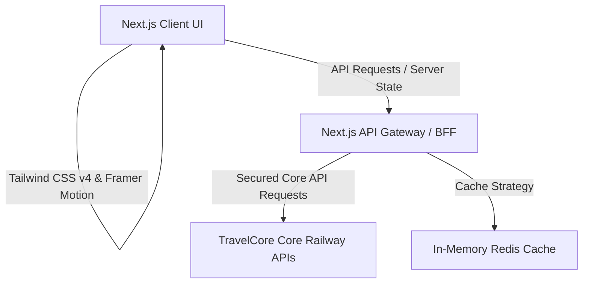

# Railverse

<p align="center">
  
</p>

<p align="center">
  <strong>India's most modern railway intelligence platform.</strong><br />
  A premium SaaS experience designed for high-performance train tracking, seat prediction, and intelligent fare comparison.
</p>

<p align="center">
  <a href="#tech-stack"><strong>Explore Tech Stack</strong></a> ·
  <a href="#development-setup"><strong>Setup Guide</strong></a> ·
  <a href="#architecture-overview"><strong>Architecture</strong></a> ·
  <a href="#git-workflow"><strong>Git Workflow</strong></a>
</p>

---

## ✦ Mission & Vision

### Mission
To build India's most modern railway intelligence platform with a world-class UI/UX, ultra-fast performance, and a premium user experience. We do not compete by offering more APIs; we win by presenting railway intelligence better than anyone else.

### Vision
To redefine how millions of travelers interact with train data in India. By replacing slow, cluttered, and outdated government portals with an elegant, component-driven SaaS application inspired by Apple, Stripe, Linear, and Vercel, we establish a new standard for national utility interfaces.

---

## ✦ Product Overview

Railverse is a travel intelligence client engineered for the modern commuter. Powered by TravelCore Technologies' core services, it synthesizes complex booking status, routing, and seat data into a fluid, visual dashboard that is highly interactive and accessible.

### Core Modules (v2.0.0)
- **PNR Status**: Elegant status visualization with automatic seat change alerts and transition indicators.
- **Train Details**: Detailed schedule mapping, coach layouts, and stop statistics with premium typography.
- **Live Train Status**: Real-time delay tracking, station approach alerts, and progress visualization utilizing smooth animations.
- **Seat Availability**: Smart forecasting matrices mapping multiple dates, quotas, and classes in a single, scanable screen.
- **Fare Comparison**: Cross-class and route fare analysis, including break-ups (base fare, superfast charges, tax) visualized using interactive graphs.

---

## ✦ Tech Stack

Railverse v2 is built on a modern, robust, and highly optimized web stack.

- **Framework**: [Next.js 15 (App Router)](https://nextjs.org) — Leveraging Server-Side Rendering (SSR), Server Components, and Streaming.
- **Language**: [TypeScript](https://www.typescriptlang.org) — End-to-end type safety, from API contracts to UI components.
- **Styling**: [Tailwind CSS v4](https://tailwindcss.com) — Modern, hardware-accelerated utility engine for layout, grid systems, and custom theme tokens.
- **UI Engine**: [Radix UI Primitives](https://www.radix-ui.com) & Custom [shadcn/ui](https://ui.shadcn.com) — Accessible, headless primitives serving as the backbone for customized, premium components.
- **Animations**: [Framer Motion](https://www.framer.com/motion/) — Fluid, physics-based animations for transitions, micro-interactions, and live status tickers.
- **State Management**: 
  - [Zustand](https://github.com/pmndrs/zustand) for lightweight client state (sidebar status, persistent filter preferences, UI state).
  - [TanStack Query v5](https://tanstack.com/query) for server state caching, pagination, and polling live train locations.

---

## ✦ Architecture Overview

Railverse uses a Backend-for-Frontend (BFF) pattern within Next.js API Routes.



### Key Architectural Guidelines
1. **React Server Components (RSC) first**: Fetch static or pre-rendered schedules on the server; use client components (`"use client"`) only for interactive components (interactive matrices, maps, filter panes).
2. **BFF Layer**: Next.js API Routes shield the TravelCore core API endpoints, handle authorization headers, format JSON schemas into clean TypeScript types, and apply rate limits.
3. **Data Caching**: Keep live coordinates cached with short TTLs, while schedules and fares are stored for longer periods.

---

## ✦ Folder Structure

```
.
├── .github/                 # GitHub workflows & Pull Request templates
├── public/                  # Static assets (logos, icons, web manifest)
├── src/
│   ├── app/                 # Next.js App Router (pages, layout, API routes)
│   ├── components/          # Reusable UI components (shadcn/ui + custom)
│   │   ├── ui/              # Headless base components (buttons, dialogs, etc.)
│   │   └── common/          # Global application layout wrappers (navbar, footers)
│   ├── hooks/               # Custom React hooks (useLiveLocation, useInterval)
│   ├── lib/                 # Core utility libraries (clients, formatting)
│   ├── providers/           # Context & State providers (Theme, QueryClient)
│   ├── store/               # Zustand global store files
│   ├── types/               # Strong TypeScript interface & API definitions
│   └── styles/              # Global css stylesheets & Tailwind v4 config
├── CONTRIBUTING.md          # Contributor workflows
├── DEVELOPMENT_GUIDELINES.md # Code standards and design rules
├── PRODUCT_REQUIREMENTS_DOCUMENT.md # Single source of truth for features
├── ROADMAP.md               # Future milestones and release plans
├── CHANGELOG.md             # Version history
└── LICENSE                  # Proprietary licensing notice
```

For a comprehensive explanation of folder responsibilities, see [PROJECT_STRUCTURE.md](file:///c:/Project%20Railverse/Railverse%20v2.0.0/PROJECT_STRUCTURE.md).

---

## ✦ Performance & Security Goals

### Performance Targets
- **Core Web Vitals**: LCP < 1.2s, FID < 50ms, CLS < 0.05.
- **Lighthouse Performance Score**: > 95 on both mobile and desktop.
- **Bundle Optimization**: Active code-splitting, tree-shaking, and lazy-loading for Framer Motion modules.
- **Render Optimizations**: Avoid layout shifts during live tracking; utilize absolute layout skeletons for loading states.

### Security Targets
- **Security Headers**: Content Security Policy (CSP), Strict-Transport-Security (HSTS), X-Frame-Options, X-Content-Type-Options.
- **API Defense**: Rate-limiting on Next.js API routes (token bucket strategy) and CSRF protection.
- **Data Protection**: Zero storage of PII (Passenger Name Records are processed stateless, or encrypted if saved locally).

---

## ✦ Development Setup

### Prerequisites
- **Node.js**: `v20.x` or higher (LTS recommended)
- **Package Manager**: `npm` (v10+) or `pnpm` (v8+)

### Step-by-Step Installation
1. Clone the repository:
   ```bash
   git clone https://github.com/travelcore/railverse-v2.git
   cd railverse-v2
   ```
2. Install dependencies:
   ```bash
   npm install
   ```
3. Set up environment variables:
   ```bash
   cp .env.example .env.local
   ```
4. Run the development server:
   ```bash
   npm run dev
   ```
   Open `http://localhost:3000` to view the application.

### Environment Variables
Configure the following keys in your `.env.local` file:

```env
# Next.js Application Environment
NEXT_PUBLIC_APP_ENV=development
NEXT_PUBLIC_APP_URL=http://localhost:3000

# TravelCore Core Railway API Credentials
TRAVELCORE_API_URL=https://api.travelcore.in/v2
TRAVELCORE_API_KEY=tc_live_prod_key_placeholder
TRAVELCORE_API_TIMEOUT=10000

# Redis Cache Configurations
REDIS_URL=redis://localhost:6379
REDIS_PASSWORD=
```

### Available Scripts
- `npm run dev` - Launches the local development server with hot-reload.
- `npm run build` - Compiles the Next.js production bundle.
- `npm run start` - Serves the compiled production bundle.
- `npm run lint` - Runs ESLint to check for syntax and styling errors.
- `npm run format` - Runs Prettier to auto-format all codebase files.
- `npm run test` - Runs unit and integration test suites using Jest.

---

## ✦ Git Workflow

We enforce a structured Git branching and commit convention to maintain a clean codebase history.

### Branch Naming Convention
Branches should represent the type of ticket and contain a ticket number or short description:
- **Feature**: `feat/` (e.g., `feat/rv-102-pnr-ui`)
- **Bug Fix**: `fix/` (e.g., `fix/rv-34-caching-bug`)
- **Performance**: `perf/` (e.g., `perf/rv-88-bundle-size`)
- **Documentation**: `docs/` (e.g., `docs/init-docs`)
- **Refactoring**: `refactor/` (e.g., `refactor/radix-dialog`)

### Commit Message Convention (Conventional Commits)
Commits must follow the [Conventional Commits](https://www.conventionalcommits.org/) format:
`type(scope): description`

Examples:
- `feat(pnr): add live status visualization transition cards`
- `fix(auth): resolve session expiration callback timeout`
- `docs(readme): add directory structure and developer prerequisites`
- `chore(deps): update framer-motion to v11.3.0`

---

## ✦ Contribution & Code Standards
Please read [CONTRIBUTING.md](file:///c:/Project%20Railverse/Railverse%20v2.0.0/CONTRIBUTING.md) and [DEVELOPMENT_GUIDELINES.md](file:///c:/Project%20Railverse/Railverse%20v2.0.0/DEVELOPMENT_GUIDELINES.md) before pushing code. Pull Requests must pass all CI linting, TypeScript compiler checks, and code reviews before merging.

---

## ✦ License & Copyright
© 2026 TravelCore Technologies Pvt. Ltd. All rights reserved.

This software is the proprietary property of **TravelCore Technologies Pvt. Ltd.** Unauthorized copying, distribution, or modifications of these files via any medium is strictly prohibited.

---

## ✦ Contact
For internal inquiries or partnerships:
- **Email**: product@travelcore.in
- **Slack**: #railverse-v2-dev
- **HQ**: TravelCore Technologies Pvt. Ltd., Mumbai, India.
