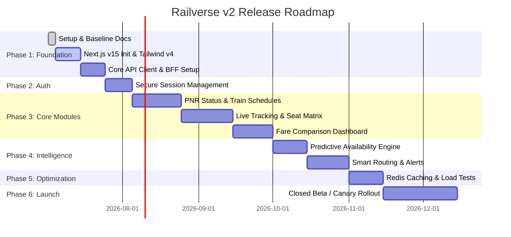

# Railverse v2 Roadmap

This roadmap outlines the development milestones and release phases for Railverse v2. It defines our path from repository setup to the final production launch.

---

## ✦ Milestone Timeline

---

## ✦ Detail of Phases

### Phase 1: Foundation (Estimated: July 2026)
Establish the underlying skeleton, coding standards, and tooling.
- **Milestone 1.1**: Initialize Next.js 15, TypeScript, Tailwind CSS v4, and Radix/shadcn configurations.
- **Milestone 1.2**: Implement base CSS system using variables in `globals.css` with accessibility contrasts.
- **Milestone 1.3**: Configure the BFF (Backend-for-Frontend) HTTP client with retry handlers and logging.
- **Milestone 1.4**: Configure testing configurations (Jest, React Testing Library, Playwright) and ESLint pre-commit hooks.

### Phase 2: Authentication (Estimated: August 2026)
Implement secure customer profiles and history storage.
- **Milestone 2.1**: Deploy a lightweight session framework utilizing JWT and secure HTTP-Only cookies.
- **Milestone 2.2**: Integrate user profiles to allow syncing PNR search history across devices.
- **Milestone 2.3**: Establish administrative security controls and rate-limiting rules.

### Phase 3: Core Railway Modules (Estimated: August – October 2026)
Develop the five user modules defined in the product specification.
- **Milestone 3.1: PNR Status Dashboard**: Visual passenger split grids, coach layout visualizations, and automatic waitlist progression updates.
- **Milestone 3.2: Train Details**: Route mappings with detailed halt metrics, sorting capabilities, and station coordinates.
- **Milestone 3.3: Live Train Tracking**: High-frequency tracking utilizing spring-physics animations for station progression indicators.
- **Milestone 3.4: Seat Availability Matrix**: multi-date matrices with color-coded availability cards, filtering, and quota configurations.
- **Milestone 3.5: Fare Comparison**: Interactive comparison graphs comparing alternative train types and listing cost breakdowns.

### Phase 4: Intelligent Features (Estimated: October – November 2026)
Introduce analytics that provide value beyond core API numbers.
- **Phase 4.1**: Create a seat confirmation probability engine using historical PNR trends.
- **Phase 4.2**: Implement alternative route recommendation logic when direct trains are fully booked.
- **Phase 4.3**: Set up push notifications and SMS alert systems for PNR status changes.

### Phase 5: Performance & Optimization (Estimated: November 2026)
Tuning and scale testing prior to launch.
- **Milestone 5.1**: Performance profiling to guarantee Largest Contentful Paint (LCP) stays under 1.2s.
- **Milestone 5.2**: Set up Redis in-memory cache tuning in the Next.js API/BFF layer.
- **Milestone 5.3**: Conduct stress testing to simulate 50,000 concurrent page sessions.

### Phase 6: Public Launch (Estimated: November – December 2026)
Phased rollout for maximum stability.
- **Phase 6.1 (Closed Beta)**: Release to internal TravelCore staff and 500 select power users.
- **Phase 6.2 (Canary Release)**: Route 10% of public traffic to the new v2 system.
- **Phase 6.3 (General Availability)**: Full cut-over to Railverse v2.0.0-stable.
